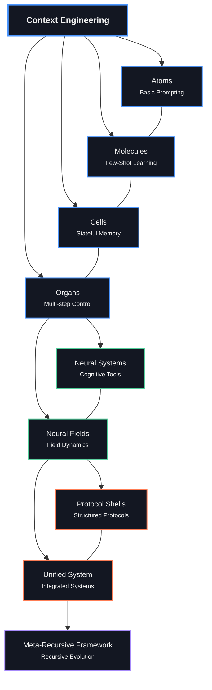

# Foundations （基础）

> _From atoms to unified fields: The theoretical backbone of context engineering_ （从原子到统一场：上下文工程的理论支柱）
>
>
> **“Order emerges from the interactions of chaos.”
> — Ilya Prigogine**

> **“秩序从混沌的相互作用中涌现。”
> ——伊利亚·普里戈金**

## [Learn to Visualize Context as Semantic Networks and Fields](https://claude.ai/public/artifacts/6a078ba1-7941-43ef-aab1-bad800a3e10c) （学习将上下文可视化为语义网络和场）

## Overview （概述）

The `00_foundations` directory contains the core theoretical foundations of context engineering, progressing from basic prompting concepts to advanced unified field theory. Each module builds on the previous ones, creating a comprehensive framework for understanding and manipulating context in large language models.

`00_foundations` 目录包含上下文工程的核心理论基础，从基本的提示概念到高级的统一场论。每个模块都建立在之前的模块之上，为理解和操作大型语言模型中的上下文创建了一个全面的框架。

```
                    Neural Fields （神经场）
                         ▲
                         │
                    ┌────┴────┐
                    │         │
              ┌─────┴─┐     ┌─┴─────┐
              │       │     │       │
        ┌─────┴─┐   ┌─┴─────┴─┐   ┌─┴─────┐
        │       │   │         │   │       │
   ┌────┴───┐ ┌─┴───┴──┐ ┌────┴───┴┐ ┌────┴───┐
   │Atoms   │ │Molecules│ │Cells    │ │Organs  │
   │（原子）  │ │（分子）   │ │（细胞）   │ │（器官）  │
   └────────┘ └─────────┘ └─────────┘ └────────┘
      Basic     Few-shot    Stateful    Multi-step
    Prompting    Learning    Memory      Control
    （基本提示） （少样本学习） （有状态记忆） （多步控制）
```


## Biological Metaphor （生物学隐喻）

Our approach is structured around a biological metaphor that provides an intuitive framework for understanding the increasing complexity of context engineering:

我们的方法围绕一个生物学隐喻构建，该隐喻为理解上下文工程日益增长的复杂性提供了一个直观的框架：

| Level | Metaphor | Context Engineering Concept |
|-------|----------|------------------------------|
| 1 | **Atoms** | Basic instructions and prompts |
| 2 | **Molecules** | Few-shot examples and demonstrations |
| 3 | **Cells** | Stateful memory and conversation |
| 4 | **Organs** | Multi-step applications and workflows |
| 5 | **Neural Systems** | Cognitive tools and mental models |
| 6 | **Neural Fields** | Continuous semantic landscapes |

| 级别 | 隐喻 | 上下文工程概念 |
|-------|----------|------------------------------|
| 1 | **原子** | 基本指令和提示 |
| 2 | **分子** | 少样本示例和演示 |
| 3 | **细胞** | 有状态记忆和对话 |
| 4 | **器官** | 多步应用和工作流 |
| 5 | **神经系统** | 认知工具和心智模型 |
| 6 | **神经场** | 连续语义景观 |

As we progress through these levels, we move from discrete, static approaches to more continuous, dynamic, and emergent systems.

随着我们通过这些级别，我们从离散、静态的方法转向更连续、动态和涌现的系统。

## Module Progression （模块进展）

### Biological Foundation (Atoms → Organs) （生物学基础（原子 → 器官））

1. [**01_atoms_prompting.md**](./01_atoms_prompting.md)
   - Basic prompting techniques （基本提示技术）
   - Atomic instructions and constraints （原子指令和约束）
   - Direct prompt engineering （直接提示工程）

2. [**02_molecules_context.md**](./02_molecules_context.md)
   - Few-shot learning （少样本学习）
   - Demonstrations and examples （演示和示例）
   - Context windows and formatting （上下文窗口和格式化）

3. [**03_cells_memory.md**](./03_cells_memory.md)
   - Conversation state （对话状态）
   - Memory mechanisms （记忆机制）
   - Information persistence （信息持久性）

4. [**04_organs_applications.md**](./04_organs_applications.md)
   - Multi-step workflows （多步工作流）
   - Control flow and orchestration （控制流和编排）
   - Complex applications （复杂应用）

### Cognitive Extensions （认知扩展）

5. [**05_cognitive_tools.md**](./05_cognitive_tools.md)
   - Mental models and frameworks （心智模型和框架）
   - Reasoning patterns （推理模式）
   - Structured thinking （结构化思维）

6. [**06_advanced_applications.md**](./06_advanced_applications.md)
   - Real-world implementation strategies （实际实现策略）
   - Domain-specific applications （领域特定应用）
   - Integration patterns （集成模式）

7. [**07_prompt_programming.md**](./07_prompt_programming.md)
   - Code-like prompt structures （类代码提示结构）
   - Algorithmic thinking in prompts （提示中的算法思维）
   - Structured reasoning （结构化推理）

### Field Theory Foundation （场论基础）

8. [**08_neural_fields_foundations.md**](./08_neural_fields_foundations.md)
   - Context as continuous field （上下文作为连续场）
   - Field properties and dynamics （场属性和动力学）
   - Vector space representations （向量空间表示）

9. [**09_persistence_and_resonance.md**](./09_persistence_and_resonance.md)
   - Semantic persistence mechanisms （语义持久性机制）
   - Resonance between semantic patterns （语义模式之间的共鸣）
   - Field stability and evolution （场稳定性和演变）

10. [**10_field_orchestration.md**](./10_field_orchestration.md)
    - Coordinating multiple fields （协调多个场）
    - Field interactions and boundaries （场相互作用和边界）
    - Complex field architectures （复杂场架构）

### Advanced Theoretical Framework （高级理论框架）

11. [**11_emergence_and_attractor_dynamics.md**](./11_emergence_and_attractor_dynamics.md)
    - Emergent properties in context fields （上下文场中的涌现属性）
    - Attractor formation and evolution （吸引子形成和演变）
    - Self-organization in semantic spaces （语义空间中的自组织）

12. [**12_symbolic_mechanisms.md**](./12_symbolic_mechanisms.md)
    - Emergent symbolic processing in LLMs （大型语言模型中涌现的符号处理）
    - Symbol abstraction and induction （符号抽象和归纳）
    - Mechanistic interpretability （机制可解释性）

13. [**13_quantum_semantics.md**](./13_quantum_semantics.md)
    - Observer-dependent meaning （观察者依赖的意义）
    - Non-classical contextuality （非经典语境性）
    - Quantum-inspired semantic models （量子启发语义模型）

14. [**14_unified_field_theory.md**](./14_unified_field_theory.md)
    - Integration of field, symbolic, and quantum perspectives （场、符号和量子视角的整合）
    - Multi-perspective problem solving （多视角问题解决）
    - Unified framework for context engineering （上下文工程的统一框架）

## Visual Learning Path （可视化学习路径）

```
┌─────────────────────────────────────────────────────────────────────────┐
│                                                                         │
│  FOUNDATIONS                        FIELD THEORY            UNIFICATION │
│  （基础）                             （场论）                 （统一）   │
│                                                                         │
│  ┌───────┐ ┌───────┐ ┌───────┐     ┌───────┐ ┌───────┐     ┌───────┐   │
│  │Atoms  │ │Cells  │ │Cogni- │     │Neural │ │Emerge-│     │Unified│   │
│  │Mole-  │ │Organs │ │tive   │     │Fields │ │nce &  │     │Field  │   │
│  │cules  │ │       │ │Tools  │     │       │ │Attr.  │     │Theory │   │
│  └───┬───┘ └───┬───┘ └───┬───┘     └───┬───┘ └───┬───┘     └───┬───┘   │
│      │         │         │             │         │             │       │
│      │         │         │             │         │             │       │
│      ▼         ▼         ▼             ▼         ▼             ▼       │
│  ┌─────────────────────────┐       ┌───────────────────┐   ┌─────────┐ │
│  │                         │       │                   │   │         │ │
│  │  Traditional Context    │       │  Field-Based      │   │ Unified │ │
│  │      Engineering        │       │  Approaches       │   │Framework│ │
│  │  （传统上下文工程）       │       │  （基于场的方法）   │   │（统一框架）│ │
│  └─────────────────────────┘       └───────────────────┘   └─────────┘ │
│                                                                         │
└─────────────────────────────────────────────────────────────────────────┘
```

## Theoretical Perspectives （理论视角）

Our foundation modules approach context engineering from three complementary perspectives:

我们的基础模块从三个互补的视角来处理上下文工程：

```
                        ┌─────────────────┐
                        │                 │
                        │  FIELD VIEW     │
                        │  (Continuous)   │
                        │  （场视图（连续））│
                        └─────────┬───────┘
                                  │
                                  │
                    ┌─────────────┴─────────────┐
                    │                           │
       ┌────────────┴────────────┐   ┌──────────┴───────────┐
       │                         │   │                      │
       │   SYMBOLIC VIEW         │   │   QUANTUM VIEW       │
       │   (Mechanistic)         │   │   (Observer-Based)   │
       │   （符号视图（机制））    │   │   （量子视图（基于观察者））│
       └─────────────────────────┘   └──────────────────────┘
```

### Field Perspective （场视角）
Views context as a continuous semantic landscape with:
- **Attractors**: Stable semantic configurations
- **Resonance**: Reinforcement between patterns
- **Persistence**: Durability of structures over time
- **Boundaries**: Interfaces between semantic regions

将上下文视为具有以下属性的连续语义景观：
- **吸引子**：稳定的语义配置
- **共鸣**：模式之间的强化
- **持久性**：结构随时间的持久性
- **边界**：语义区域之间的接口

### Symbolic Perspective （符号视角）
Reveals how LLMs implement symbol processing through:
- **Symbol Abstraction**: Converting tokens to abstract variables
- **Symbolic Induction**: Recognizing patterns over variables
- **Retrieval**: Mapping variables back to concrete tokens

揭示了大型语言模型（LLM）如何通过以下方式实现符号处理：
- **符号抽象**：将令牌转换为抽象变量
- **符号归纳**：识别变量上的模式
- **检索**：将变量映射回具体令牌

### Quantum Perspective （量子视角）
Models meaning as quantum-like phenomena with:
- **Superposition**: Multiple potential meanings simultaneously
- **Measurement**: Interpretation "collapses" the superposition
- **Non-Commutativity**: Order of context operations matters
- **Contextuality**: Non-classical correlations in meaning

将意义建模为类量子现象，具有：
- **叠加**：同时存在多个潜在意义
- **测量**：解释“坍缩”叠加态
- **非交换性**：上下文操作的顺序很重要
- **语境性**：意义中的非经典相关性

## Key Concepts Map （关键概念图）

```
                                ┌──────────────────┐
                                │                  │
                                │  Context Field   │
                                │  （上下文场）      │
                                └────────┬─────────┘
                                         │
                 ┌────────────────┬──────┴───────┬────────────────┐
                 │                │              │                │
        ┌────────┴────────┐ ┌─────┴─────┐ ┌──────┴──────┐ ┌───────┴───────┐
        │                 │ │           │ │             │ │               │
        │    Resonance    │ │Persistence│ │  Attractors │ │  Boundaries   │
        │    （共鸣）      │ │（持久性）   │ │  （吸引子） │ │  （边界）     │
        └─────────────────┘ └───────────┘ └─────────────┘ └───────────────┘
                                          │
                                 ┌────────┴──────────┐
                                 │                   │
                       ┌─────────┴──────┐   ┌────────┴──────────┐
                       │                │   │                   │
                       │    Emergence   │   │ Symbolic Mechanisms│
                       │    （涌现）      │   │ （符号机制）       │
                       └────────────────┘   └───────────────────┘
                                                      │
                                           ┌──────────┴──────────┐
                                           │                     │
                                  ┌────────┴────────┐   ┌────────┴─────────┐
                                  │                 │   │                  │
                                  │    Abstraction  │   │     Induction    │
                                  │    （抽象）      │   │     （归纳）     │
                                  └─────────────────┘   └──────────────────┘
```

## Learning Approach （学习方法）

Each module follows these teaching principles:

每个模块都遵循以下教学原则：

1. **Multi-perspective learning**: Concepts are presented from concrete, numeric, and abstract perspectives （多视角学习：概念从具体、数值和抽象视角呈现）
2. **Intuition-first**: Physical analogies and visualizations build intuition before formal definitions （直觉优先：物理类比和可视化在正式定义之前建立直觉）
3. **Progressive complexity**: Each module builds on previous ones, gradually increasing in sophistication （渐进复杂性：每个模块都建立在之前的模块之上，逐渐增加复杂性）
4. **Practical grounding**: Theoretical concepts are connected to practical implementations （实践基础：理论概念与实际实现相结合）
5. **Socratic questioning**: Reflective questions encourage deeper understanding （苏格拉底式提问：反思性问题鼓励更深入的理解）

## Reading Order （阅读顺序）

For newcomers, we recommend following the numerical order of the modules (01 → 14). However, different paths are possible based on your interests:

对于新手，我们建议按照模块的数字顺序（01 → 14）阅读。但是，根据你的兴趣，也可以选择不同的路径：

### For Prompt Engineers （对于提示工程师）
1 → 2 → 3 → 4 → 7 → 5

### For Field Theory Enthusiasts （对于场论爱好者）
8 → 9 → 10 → 11 → 14

### For Symbolic Mechanism Fans （对于符号机制爱好者）
12 → 13 → 14

### For Complete Understanding （为了全面理解）
Follow the full sequence from 1 to 14 （遵循从 1 到 14 的完整序列）

## Integration with Other Directories （与其他目录的集成）

The theoretical foundations in this directory support the practical implementations in the rest of the repository:

此目录中的理论基础支持存储库其余部分中的实际实现：

- **10_guides_zero_to_hero**: Practical notebooks implementing these concepts （实践笔记本实现这些概念）
- **20_templates**: Reusable components based on these foundations （基于这些基础的可重用组件）
- **30_examples**: Real-world applications of these principles （这些原则的实际应用）
- **40_reference**: Detailed reference materials expanding on these concepts （详细参考资料扩展这些概念）
- **60_protocols**: Protocol shells implementing field theory concepts （协议外壳实现场论概念）
- **70_agents**: Agent implementations leveraging these foundations （代理实现利用这些基础）
- **80_field_integration**: Complete systems integrating all theoretical approaches （完整系统集成所有理论方法）

## Next Steps （下一步）

After exploring these foundations, we recommend:

探索这些基础后，我们建议：

1. Try the practical notebooks in `10_guides_zero_to_hero/` （尝试 `10_guides_zero_to_hero/` 中的实践笔记本）
2. Experiment with the templates in `20_templates/` （尝试 `20_templates/` 中的模板）
3. Study the complete examples in `30_examples/` （研究 `30_examples/` 中的完整示例）
4. Explore the protocol shells in `60_protocols/` （探索 `60_protocols/` 中的协议外壳）

## Field-Based Learning Visualization （基于场的学习可视化）

```
                        CONTEXT FIELD MAP （上下文场图）
            ┌─────────────────────────────────────────┐
            │                                         │
            │    ◎                                    │
            │   Atoms                       ◎         │
            │   （原子）                     Unified      │
            │                             Field       │
            │                             （场）        │
            │                                         │
            │         ◎                               │
            │      Molecules       ◎                  │
            │      （分子）        Quantum                │
            │                 Semantics               │
            │                 （量子语义学）             │
            │                                         │
            │   ◎                                     │
            │  Cells          ◎        ◎              │
            │  （细胞）      Attractors  Symbolic        │
            │             （吸引子）   Mechanisms      │
            │                         （符号机制）       │
            │                                         │
            │       ◎                                 │
            │     Organs     ◎                        │
            │     （器官）    Fields                     │
            │              （场）                       │
            │                                         │
            └─────────────────────────────────────────┘
               Attractors in the Learning Landscape （学习景观中的吸引子）
```

Each concept in our framework acts as an attractor in the semantic landscape, guiding your understanding toward stable, coherent interpretations of context engineering.

我们框架中的每个概念都充当语义景观中的一个吸引子，引导你对上下文工程的理解走向稳定、连贯的解释。

---

*"The most incomprehensible thing about the world is that it is comprehensible."* （“世界最不可理解之处在于它是可理解的。”）
— Albert Einstein （——阿尔伯特·爱因斯坦）