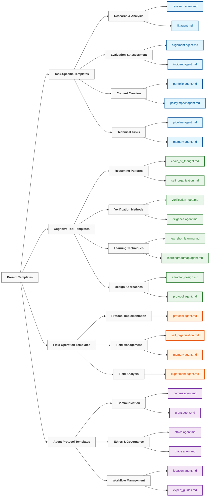

# Context Engineering Prompt Templates （上下文工程提示模板）

> "The diversity of languages is not a diversity of signs and sounds but a diversity of views of the world." — **Wilhelm von Humboldt**
> “语言的多样性不是符号和声音的多样性，而是世界观的多样性。”——**威廉·冯·洪堡**

## Overview （概述）

The `PROMPTS` directory contains specialized, ready-to-use prompt templates that implement context engineering principles for specific applications. These templates go beyond basic prompt engineering to incorporate structured context management, field theory concepts, and recursive improvement mechanisms.
`PROMPTS` 目录包含专门的、即用型提示模板，这些模板为特定应用程序实现了上下文工程原则。这些模板超越了基本的提示工程，融入了结构化上下文管理、场论概念和递归改进机制。

Each template follows a standardized format designed for reuse, adaptation, and composition with other context engineering components.
每个模板都遵循标准化格式，旨在与其它上下文工程组件进行重用、改编和组合。

## Prompt Template Structure （提示模板结构）

```
┌──────────────────────────────────────────────────────────┐
│                      META SECTION                        │
│ Version, author, purpose, context requirements           │
├──────────────────────────────────────────────────────────┤
│                  STRUCTURE SECTION                       │
│ Template structure, parameters, expected inputs/outputs  │
├──────────────────────────────────────────────────────────┤
│                   CONTEXT SECTION                        │
│ Field setup, attractors, residue tracking, coherence     │
├──────────────────────────────────────────────────────────┤
│                    PROMPT SECTION                        │
│ Actual prompt template with parameter placeholders       │
├──────────────────────────────────────────────────────────┤
│                  WORKFLOW SECTION                        │
│ Multi-stage process flow, feedback loops                 │
├──────────────────────────────────────────────────────────┤
│                   EXAMPLES SECTION                       │
│ Sample use cases, inputs/outputs, variations             │
└──────────────────────────────────────────────────────────┘
```

## Prompt Categories （提示类别）

The prompt templates are organized into several categories based on their application domains and complexity:
提示模板根据其应用领域和复杂性分为几个类别：




### Task-Specific Templates （任务特定模板）

Templates designed for specific applications and domains:
为特定应用和领域设计的模板：

| Template | Purpose | Key Features |
|----------|---------|-------------|
| [`alignment.agent.md`](./alignment.agent.md) | AI safety/alignment evaluation | Value tracking, artifact decomposition, bias detection |
| [`alignment.agent.md`](./alignment.agent.md) | AI 安全/对齐评估 | 价值跟踪、工件分解、偏见检测 |
| [`research.agent.md`](./research.agent.md) | Literature review and synthesis | Citation tracking, claim validation, insight extraction |
| [`research.agent.md`](./research.agent.md) | 文献综述与综合 | 引用跟踪、声明验证、洞察提取 |
| [`incident.agent.md`](./incident.agent.md) | Post-incident analysis | Root cause identification, multi-factor analysis, bias mitigation |
| [`incident.agent.md`](./incident.agent.md) | 事后分析 | 根本原因识别、多因素分析、偏见缓解 |
| [`lit.agent.md`](./lit.agent.md) | Literary analysis | Theme detection, character mapping, narrative pattern recognition |
| [`lit.agent.md`](./lit.agent.md) | 文学分析 | 主题检测、人物映射、叙事模式识别 |

### Cognitive Tool Templates （认知工具模板）

Templates that implement specific reasoning patterns:
实现特定推理模式的模板：

| Template | Purpose | Key Features |
|----------|---------|-------------|
| [`chain_of_thought.md`](./chain_of_thought.md) | Step-by-step reasoning | Transparent decision tracking, assumption flagging, branch management |
| [`chain_of_thought.md`](./chain_of_thought.md) | 逐步推理 | 透明决策跟踪、假设标记、分支管理 |
| [`verification_loop.md`](./verification_loop.md) | Self-verification workflows | Error detection, assumption validation, counter-example generation |
| [`verification_loop.md`](./verification_loop.md) | 自我验证工作流程 | 错误检测、假设验证、反例生成 |
| [`few_shot_learning.md`](./few_shot_learning.md) | Learning from examples | Pattern abstraction, generalization mapping, edge case generation |
| [`few_shot_learning.md`](./few_shot_learning.md) | 从示例中学习 | 模式抽象、泛化映射、边缘案例生成 |
| [`attractor_design.md`](./attractor_design.md) | Semantic attractor creation | Field stability, persistent theme development, resonance optimization |
| [`attractor_design.md`](./attractor_design.md) | 语义吸引子创建 | 场稳定性、持久主题开发、共振优化 |

### Field Operation Templates （场操作模板）

Templates implementing neural field concepts:
实现神经场概念的模板：

| Template | Purpose | Key Features |
|----------|---------|-------------|
| [`protocol.agent.md`](./protocol.agent.md) | Field protocol orchestration | Shell execution, operation sequencing, field measurement |
| [`protocol.agent.md`](./protocol.agent.md) | 场协议编排 | Shell 执行、操作排序、场测量 |
| [`self_organization.md`](./self_organization.md) | Emergent pattern facilitation | Attractor formation, boundary dissolution, resonance amplification |
| [`self_organization.md`](./self_organization.md) | 涌现模式促进 | 吸引子形成、边界消融、共振放大 |
| [`memory.agent.md`](./memory.agent.md) | Long-term memory management | Residue tracking, compression techniques, retrieval optimization |
| [`memory.agent.md`](./memory.agent.md) | 长期记忆管理 | 残留跟踪、压缩技术、检索优化 |

### Agent Protocol Templates （代理协议模板）

Templates for autonomous agent implementations:
用于自主代理实现的模板：

| Template | Purpose | Key Features |
|----------|---------|-------------|
| [`comms.agent.md`](./comms.agent.md) | Communication management | Audience analysis, messaging strategy, tone calibration |
| [`comms.agent.md`](./comms.agent.md) | 通信管理 | 受众分析、消息策略、语调校准 |
| [`diligence.agent.md`](./diligence.agent.md) | Thorough investigation | Comprehensive analysis, source triangulation, assumption testing |
| [`diligence.agent.md`](./diligence.agent.md) | 彻底调查 | 全面分析、来源三角测量、假设测试 |
| [`ethics.agent.md`](./ethics.agent.md) | Ethical decision making | Value frameworks, stakeholder analysis, principle application |
| [`ethics.agent.md`](./ethics.agent.md) | 伦理决策 | 价值框架、利益相关者分析、原则应用 |
| [`triage.agent.md`](./triage.agent.md) | Priority assessment | Impact evaluation, urgency assessment, resource allocation |
| [`triage.agent.md`](./triage.agent.md) | 优先级评估 | 影响评估、紧急性评估、资源分配 |

## Usage Patterns （使用模式）

### Basic Template Application （基本模板应用）

To use a prompt template in its simplest form:
以最简单的形式使用提示模板：

```python
import re

# Load template
with open('PROMPTS/research.agent.md', 'r') as f:
    template = f.read()

# Replace parameters
filled_template = template.replace('{{RESEARCH_TOPIC}}', 'climate change mitigation')
                         .replace('{{FOCUS_AREA}}', 'carbon capture technologies')
                         .replace('{{TIME_FRAME}}', 'last 5 years')

# Use with LLM
response = llm.generate(filled_template)
```

### Advanced Integration （高级集成）

For more sophisticated applications, integrate with other context engineering components:
对于更复杂的应用，请与其他上下文工程组件集成：

```python
from templates.prompt_program_template import PromptProgram
from templates.field_protocol_shells import ProtocolShell

# Load prompt template
with open('PROMPTS/protocol.agent.md', 'r') as f:
    template = f.read()
    
# Extract context section
context_section = re.search(r'## Context\s+```yaml\s+(.*?)\s+```', 
                          template, re.DOTALL).group(1)
                          
# Parse context configuration
context_config = yaml.safe_load(context_section)

# Create field protocol
protocol = ProtocolShell.from_dict(context_config.get('protocol', {}))

# Create prompt program with the template
program = PromptProgram(
    description=context_config.get('description', ''),
    template=template
)

# Execute integrated system
result = program.execute_with_protocol(protocol, {'input': user_query})
```

### Template Customization （模板定制）

Templates can be customized for specific use cases:
模板可以针对特定用例进行定制：

1. **Parameter Adjustment**: Modify placeholder values for your specific needs
1. **参数调整**：根据您的特定需求修改占位符值
2. **Section Enhancement**: Add specialized sections for your domain
2. **章节增强**：为您的领域添加专门章节
3. **Context Integration**: Connect with your knowledge base or retrieval system
3. **上下文集成**：连接到您的知识库或检索系统
4. **Workflow Modification**: Adapt the process flow for your specific task
4. **工作流程修改**：根据您的特定任务调整流程
5. **Field Tuning**: Adjust attractor strengths and field parameters
5. **场调优**：调整吸引子强度和场参数

## Implementation Principles （实施原则）

All prompt templates in this directory follow these core principles:
此目录中的所有提示模板都遵循以下核心原则：

1. **Layered Structure**: Building from fundamental prompts to complex systems
1. **分层结构**：从基本提示构建到复杂系统
2. **Parameterization**: Clear parameter interfaces for customization
2. **参数化**：清晰的参数接口，便于定制
3. **Context Awareness**: Explicit context management and field dynamics
3. **上下文感知**：显式上下文管理和场动力学
4. **Workflow Integration**: Defined process flows and interaction patterns
4. **工作流程集成**：定义流程和交互模式
5. **Example Provision**: Concrete examples demonstrating effective use
5. **示例提供**：具体示例演示有效使用
6. **Documentation**: Comprehensive explanations of design and application
6. **文档**：设计和应用的全面解释
7. **Modularity**: Ability to compose with other templates and components
7. **模块化**：能够与其他模板和组件组合

## Development Guidelines （开发指南）

When creating new prompt templates, follow these guidelines:
创建新提示模板时，请遵循以下指南：

1. Use the standardized section structure
1. 使用标准化的章节结构
2. Document all parameters with clear descriptions
2. 用清晰的描述记录所有参数
3. Include at least three example use cases
3. 至少包含三个示例用例
4. Specify context requirements and field dynamics
4. 指定上下文要求和场动力学
5. Implement appropriate workflow processes
5. 实施适当的工作流程
6. Test across different models and scenarios
6. 在不同模型和场景下进行测试
7. Follow naming convention: `[domain].[purpose].md`
7. 遵循命名约定：`[domain].[purpose].md`

## Learning Path （学习路径）

For those new to context engineering prompts, we recommend this progression:
对于上下文工程提示的新手，我们建议按此顺序学习：

1. Start with basic task-specific templates
1. 从基本的任务特定模板开始
2. Move to cognitive tool templates to learn reasoning patterns
2. 转向认知工具模板以学习推理模式
3. Explore field operation templates for advanced context dynamics
3. 探索场操作模板以了解高级上下文动态
4. Experiment with agent protocol templates for autonomous systems
4. 尝试代理协议模板以实现自主系统

## Related Resources （相关资源）

- See [`../minimal_context.yaml`](../minimal_context.yaml) for foundational context structure
- 有关基础上下文结构，请参阅 [`../minimal_context.yaml`](../minimal_context.yaml)
- See [`../prompt_program_template.py`](../prompt_program_template.py) for program structures
- 有关程序结构，请参阅 [`../prompt_program_template.py`](../prompt_program_template.py)
- See [`../field_protocol_shells.py`](../field_protocol_shells.py) for field operations
- 有关场操作，请参阅 [`../field_protocol_shells.py`](../field_protocol_shells.py)
- See [`../../30_examples/`](../../30_examples/) for complete implementations
- 有关完整实现，请参阅 [`../../30_examples/`](../../30_examples/)

---

*This directory is continuously expanded with new templates as context engineering techniques evolve. Contributions are welcome via pull requests.*
*随着上下文工程技术的不断发展，此目录将不断扩展新的模板。欢迎通过拉取请求贡献。*