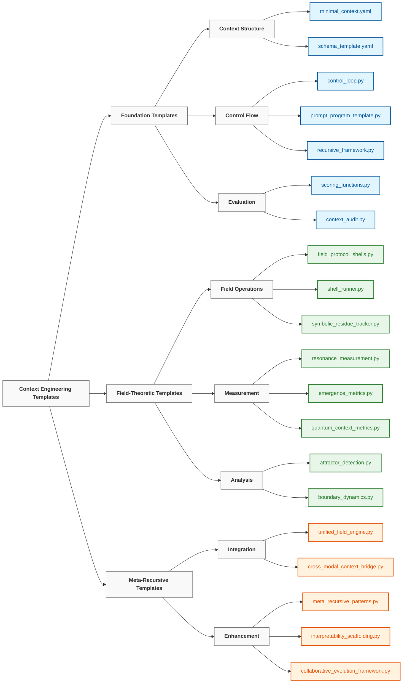

# Context Engineering Templates （上下文工程模板）

> "We have to cease to think if we refuse to do it in the prison house of language." — **Friedrich Nietzsche**
> “如果拒绝在语言的牢笼中思考，我们就必须停止思考。”——**弗里德里希·尼采**

## Overview （概述）

The `20_templates` directory provides a collection of reusable, composable components for implementing context engineering principles across a wide range of applications. Each template encapsulates a specific pattern or mechanism that can be combined to create sophisticated context management systems.
`20_templates` 目录提供了一系列可重用、可组合的组件，用于在各种应用程序中实现上下文工程原则。每个模板都封装了一个特定的模式或机制，可以组合起来创建复杂的上下文管理系统。

These templates follow a progressive complexity model, starting with basic structures and building toward advanced field-theoretic implementations:
这些模板遵循渐进式复杂性模型，从基本结构开始，逐步构建到高级场论实现：

```
atoms → molecules → cells → organs → neural systems → neural fields
  │        │         │        │             │              │
single    few-     memory/   multi-    cognitive tools   fields +
prompt    shot     agents    agents    prompt programs   persistence
```

## Template Categories （模板类别）



### Foundation Templates （基础模板）

Fundamental building blocks for basic context engineering:
基本上下文工程的基础构建块：

| Template | Purpose | Usage |
|----------|---------|-------|
| [`minimal_context.yaml`](./minimal_context.yaml) | Lightweight template for general-purpose LLM interactions | Starting point for any context engineering project |
| [`minimal_context.yaml`](./minimal_context.yaml) | 用于通用 LLM 交互的轻量级模板 | 任何上下文工程项目的起点 |
| [`schema_template.yaml`](./schema_template.yaml) | Data structure definitions for standardized context formats | Ensuring consistent context representation |
| [`schema_template.yaml`](./schema_template.yaml) | 用于标准化上下文格式的数据结构定义 | 确保一致的上下文表示 |
| [`control_loop.py`](./control_loop.py) | Framework for iterative context processing | Implementing cyclic refinement workflows |
| [`control_loop.py`](./control_loop.py) | 迭代上下文处理框架 | 实现循环细化工作流程 |
| [`prompt_program_template.py`](./prompt_program_template.py) | Structured prompting patterns for complex reasoning | Creating code-like reasoning structures |
| [`prompt_program_template.py`](./prompt_program_template.py) | 用于复杂推理的结构化提示模式 | 创建类似代码的推理结构 |
| [`scoring_functions.py`](./scoring_functions.py) | Evaluation metrics for context quality | Quantitative assessment of context effectiveness |
| [`scoring_functions.py`](./scoring_functions.py) | 上下文质量评估指标 | 上下文有效性的定量评估 |

### Field-Theoretic Templates （场论模板）

Advanced components implementing neural field theory principles:
实现神经场理论原理的高级组件：

| Template | Purpose | Usage |
|----------|---------|-------|
| [`field_protocol_shells.py`](./field_protocol_shells.py) | Templates for field operations | Implementing standardized field manipulation protocols |
| [`field_protocol_shells.py`](./field_protocol_shells.py) | 场操作模板 | 实现标准化场操作协议 |
| [`neural_field_context.yaml`](./neural_field_context.yaml) | Configuration for neural field-based context | Setting up continuous semantic fields |
| [`neural_field_context.yaml`](./neural_field_context.yaml) | 基于神经场的上下文配置 | 设置连续语义场 |
| [`resonance_measurement.py`](./resonance_measurement.py) | Tools for measuring field harmony | Quantifying semantic relationships |
| [`resonance_measurement.py`](./resonance_measurement.py) | 测量场和谐的工具 | 量化语义关系 |
| [`attractor_detection.py`](./attractor_detection.py) | Techniques for identifying semantic attractors | Finding stable patterns in context fields |
| [`attractor_detection.py`](./attractor_detection.py) | 识别语义吸引子的技术 | 在上下文场中寻找稳定模式 |
| [`symbolic_residue_tracker.py`](./symbolic_residue_tracker.py) | System for monitoring symbolic fragments | Tracking persistent information |
| [`symbolic_residue_tracker.py`](./symbolic_residue_tracker.py) | 符号残余跟踪系统 | 跟踪持久信息 |

### Meta-Recursive Templates （元递归模板）

Advanced templates for self-improving and integrated systems:
用于自我改进和集成系统的高级模板：

| Template | Purpose | Usage |
|----------|---------|-------|
| [`meta_recursive_patterns.py`](./meta_recursive_patterns.py) | Patterns for self-improvement | Creating systems that enhance themselves |
| [`meta_recursive_patterns.py`](./meta_recursive_patterns.py) | 自我改进模式 | 创建自我增强系统 |
| [`unified_field_engine.py`](./unified_field_engine.py) | Integration of multiple field operations | Coordinating complex field interactions |
| [`unified_field_engine.py`](./unified_field_engine.py) | 多个场操作的集成 | 协调复杂的场交互 |
| [`interpretability_scaffolding.py`](./interpretability_scaffolding.py) | Frameworks for transparency | Making operations understandable |
| [`interpretability_scaffolding.py`](./interpretability_scaffolding.py) | 透明度框架 | 使操作易于理解 |
| [`collaborative_evolution_framework.py`](./collaborative_evolution_framework.py) | Human-AI partnership structures | Facilitating effective collaboration |
| [`collaborative_evolution_framework.py`](./collaborative_evolution_framework.py) | 人机协作伙伴关系结构 | 促进有效协作 |
| [`cross_modal_context_bridge.py`](./cross_modal_context_bridge.py) | Multi-modal integration patterns | Unifying understanding across modalities |
| [`cross_modal_context_bridge.py`](./cross_modal_context_bridge.py) | 多模态集成模式 | 统一跨模态理解 |

## Implementation Strategy （实施策略）

These templates follow a consistent implementation strategy with the following principles:
这些模板遵循一致的实施策略，具有以下原则：

1. **Layered Approach**: Building from foundational concepts to advanced integration
1. **分层方法**：从基础概念构建到高级集成
2. **Practical Focus**: Ensuring all theory has corresponding practical implementation
2. **实践重点**：确保所有理论都有相应的实践实现
3. **Modular Design**: Creating composable components that can be recombined
3. **模块化设计**：创建可重组的可组合组件
4. **Progressive Complexity**: Starting simple, adding sophistication incrementally
4. **渐进复杂性**：从简单开始，逐步增加复杂性
5. **Integration Emphasis**: Focusing on how components work together, not just individually
5. **集成重点**：侧重于组件如何协同工作，而不仅仅是单独工作
6. **Self-Improvement**: Building systems that can enhance themselves
6. **自我改进**：构建能够自我增强的系统
7. **Transparency**: Ensuring operations remain understandable despite complexity
7. **透明度**：确保操作在复杂性下仍然易于理解
8. **Collaboration**: Designing for effective human-AI partnership
8. **协作**：设计有效的人机协作伙伴关系
9. **Modal Flexibility**: Supporting unified understanding across different modalities
9. **模态灵活性**：支持跨不同模态的统一理解

## Usage Patterns （使用模式）

### Basic Template Adaptation （基本模板适应）

Templates can be adapted through simple configuration changes:
模板可以通过简单的配置更改进行适应：

```python
import yaml

# Load the template
with open('minimal_context.yaml', 'r') as f:
    context_template = yaml.safe_load(f)

# Customize for your specific use case
context_template['system']['role'] = "specialized_assistant"
context_template['token_budget'] = 500

# Use the customized template
# ...
```

### Component Composition （组件组合）

Combine multiple templates to create sophisticated systems:
组合多个模板以创建复杂的系统：

```python
from templates.prompt_program_template import PromptProgram
from templates.field_protocol_shells import ProtocolShell

# Create a prompt program
program = PromptProgram("Solve complex reasoning tasks")
program.add_step("Parse the problem")
program.add_step("Identify relevant concepts")
# ...

# Integrate with protocol shell
protocol = ProtocolShell.from_file("path/to/reasoning.shell")
protocol_program = protocol.create_program(program)

# Execute the integrated system
result = protocol_program.execute(input_data)
```

### Progressive Enhancement （渐进增强）

Start with basic templates and progressively enhance them:
从基本模板开始，逐步增强它们：

1. Begin with `minimal_context.yaml` for simple interactions
1. 从 `minimal_context.yaml` 开始，用于简单交互
2. Add structured evaluation using `scoring_functions.py`
2. 使用 `scoring_functions.py` 添加结构化评估
3. Implement iterative refinement with `control_loop.py`
3. 使用 `control_loop.py` 实现迭代细化
4. Introduce field dynamics using `field_protocol_shells.py`
4. 使用 `field_protocol_shells.py` 引入场动力学
5. Integrate self-improvement with `meta_recursive_patterns.py`
5. 使用 `meta_recursive_patterns.py` 集成自我改进

## Learning Path （学习路径）

For those new to context engineering, we recommend the following learning path:
对于上下文工程的新手，我们推荐以下学习路径：

```
┌─────────────────┐     ┌──────────────────┐     ┌────────────────┐
│ minimal_context │     │ control_loop +   │     │ field_protocol │
│     .yaml       │────▶│ prompt_program   │────▶│    _shells     │
│                 │     │                  │     │                │
└─────────────────┘     └──────────────────┘     └────────────────┘
         │                                                │
         │                                                │
         ▼                                                ▼
┌─────────────────┐                             ┌────────────────┐
│    scoring_     │◀───────────────────────────▶│  resonance_    │
│   functions     │                             │  measurement   │
│                 │                             │                │
└─────────────────┘                             └────────────────┘
         ▲                                                ▲
         │                                                │
         └────────────────────┐               ┌───────────┘
                              ▼               ▼
                         ┌─────────────────────┐
                         │  meta_recursive_    │
                         │     patterns        │
                         │                     │
                         └─────────────────────┘
```

## Template Development （模板开发）

When creating new templates or modifying existing ones, follow these guidelines:
创建新模板或修改现有模板时，请遵循以下指南：

1. **Maintain Compatibility**: Ensure new templates work with existing ones
1. **保持兼容性**：确保新模板与现有模板兼容
2. **Document Thoroughly**: Include clear documentation and examples
2. **彻底文档化**：包含清晰的文档和示例
3. **Progressive Enhancement**: Design for gradual adoption and extension
3. **渐进增强**：设计用于逐步采用和扩展
4. **Test Comprehensively**: Verify templates across different scenarios
4. **全面测试**：在不同场景下验证模板
5. **Provide Defaults**: Include sensible defaults for all parameters
5. **提供默认值**：为所有参数提供合理的默认值

## Additional Resources （附加资源）

- See [`../00_foundations/`](../00_foundations/) for theoretical background
- 有关理论背景，请参阅 [`../00_foundations/`](../00_foundations/)
- See [`../10_guides_zero_to_hero/`](../10_guides_zero_to_hero/) for practical tutorials
- 有关实践教程，请参阅 [`../10_guides_zero_to_hero/`](../10_guides_zero_to_hero/)
- See [`../30_examples/`](../30_examples/) for complete implementations
- 有关完整实现，请参阅 [`../30_examples/`](../30_examples/)
- See [`../40_reference/`](../40_reference/) for detailed documentation
- 有关详细文档，请参阅 [`../40_reference/`](../40_reference/)

---

*This directory is actively maintained and expanded with new templates as the field of context engineering evolves. Contributions are welcome via pull requests.*
*随着上下文工程领域的不断发展，此目录将积极维护并扩展新模板。欢迎通过拉取请求贡献。*