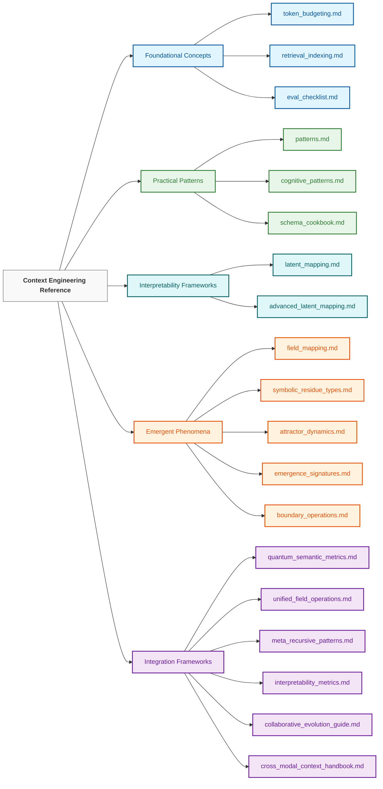

# Context Engineering: Reference Documentation （上下文工程：参考文档）

> "We dissect nature along lines laid down by our native language."
>
> [**— Benjamin Lee Whorf**](https://en.wikipedia.org/wiki/Benjamin_Lee_Whorf), father of the [**Sapir-Whorf Linguistic Relativity Hypothesis**](https://en.wikipedia.org/wiki/Linguistic_relativity)
> 
> 
> The concept that language influences thought, not the other way around
>
> This is especially relevant in our field of Context Engineering, where we are tasked with guiding and debugging agentic thought

> "我们沿着母语所设定的界限来剖析自然。"
>
> [**— 本杰明·李·沃夫**](https://zh.wikipedia.org/wiki/%E6%9C%AC%E6%9D%B0%E6%98%8E%C2%B7%E6%9D%8E%C2%B7%E6%B2%83%E5%A4%AB)，[**萨丕尔-沃夫假说**](https://zh.wikipedia.org/wiki/%E8%90%A8%E5%BF%85%E5%B0%94-%E6%B2%83%E5%A4%AB%E5%81%87%E8%AF%B4)之父
>
> 语言影响思想，而非反之
>
> 这在我们的上下文工程领域尤为重要，因为我们的任务是引导和调试智能体的思维

## Overview （概述）

Welcome to the Reference Documentation section of the Context Engineering repository. This directory contains comprehensive guides, taxonomies, and technical specifications that serve as the theoretical foundation and practical reference for context engineering practices.

欢迎来到上下文工程仓库的参考文档部分。本目录包含全面的指南、分类法和技术规范，它们是上下文工程实践的理论基础和实用参考。

These reference materials are designed to complement the more hands-on guides found in the `10_guides_zero_to_hero` and `30_examples` directories, providing deeper insight into the underlying concepts, patterns, and frameworks.

这些参考材料旨在补充 `10_guides_zero_to_hero` 和 `30_examples` 目录中更具实践性的指南，提供对底层概念、模式和框架的更深入见解。

```
┌─────────────────────────────────────────────────────────┐
│                REFERENCE ARCHITECTURE                   │
├─────────────────────────────────────────────────────────┤
│                                                         │
│  FOUNDATIONS → PATTERNS → PHENOMENA → APPLICATIONS      │
│  (Concepts)    (Methods)   (Effects)    (Use Cases)     │
│                                                         │
│  • Understanding the underlying theory                  │
│  • Building a common vocabulary                         │
│  • Establishing evaluation frameworks                   │
│  • Documenting field consensus and open questions       │
│  • Providing design patterns and best practices         │
│                                                         │
└─────────────────────────────────────────────────────────┘
```

## How to Use This Directory （如何使用本目录）

The reference documentation is organized into five main categories to support different learning and application needs:

参考文档分为五个主要类别，以支持不同的学习和应用需求：

1. **Foundational Concepts**: Core principles and frameworks that underpin context engineering
2. **Practical Patterns**: Design patterns, schemas, and methodologies for implementation
3. **Interpretability Frameworks**: Tools and methods for understanding and visualizing AI reasoning
4. **Emergent Phenomena**: Documentation of complex emergent properties in context systems
5. **Integration Frameworks**: Guides for combining approaches into comprehensive systems

1. **基础概念**：支撑上下文工程的核心原则和框架
2. **实用模式**：用于实现的模式、模式和方法
3. **可解释性框架**：理解和可视化 AI 推理的工具和方法
4. **涌现现象**：上下文系统中复杂涌现属性的文档
5. **集成框架**：将方法组合成综合系统的指南

### Learning Path （学习路径）

For those new to context engineering, we recommend the following learning path:

对于上下文工程的新手，我们推荐以下学习路径：



## Directory Contents （目录内容）

### Foundational Concepts （基础概念）

| Document | Description | Key Applications |
|----------|-------------|------------------|
| **[token_budgeting.md](./token_budgeting.md)** | Comprehensive guide to optimizing token usage through resource allocation strategies | Budget planning, cost optimization, context window management |
| **[retrieval_indexing.md](./retrieval_indexing.md)** | Reference for information retrieval systems and indexing methodologies | RAG implementations, knowledge base design, retrieval optimization |
| **[eval_checklist.md](./eval_checklist.md)** | Evaluation methodology and criteria for context engineering systems | Quality assessment, performance measurement, system validation |

| 文档 | 描述 | 主要应用 |
|----------|-------------|------------------|
| **[token_budgeting.md](./token_budgeting.md)** | 通过资源分配策略优化 token 使用的综合指南 | 预算规划、成本优化、上下文窗口管理 |
| **[retrieval_indexing.md](./retrieval_indexing.md)** | 信息检索系统和索引方法论的参考 | RAG 实现、知识库设计、检索优化 |
| **[eval_checklist.md](./eval_checklist.md)** | 上下文工程系统的评估方法论和标准 | 质量评估、性能测量、系统验证 |

### Practical Patterns （实用模式）

| Document | Description | Key Applications |
|----------|-------------|------------------|
| **[patterns.md](./patterns.md)** | General design patterns for context engineering systems | Architecture design, solution development, pattern recognition |
| **[cognitive_patterns.md](./cognitive_patterns.md)** | Library of reasoning patterns for enhancing AI cognitive capabilities | Reasoning enhancement, cognitive scaffolding, problem-solving frameworks |
| **[schema_cookbook.md](./schema_cookbook.md)** | Collection of schema design patterns for structured information representation | Data modeling, knowledge representation, information organization |

| 文档 | 描述 | 主要应用 |
|----------|-------------|------------------|
| **[patterns.md](./patterns.md)** | 上下文工程系统的通用设计模式 | 架构设计、解决方案开发、模式识别 |
| **[cognitive_patterns.md](./cognitive_patterns.md)** | 用于增强 AI 认知能力的推理模式库 | 推理增强、认知脚手架、问题解决框架 |
| **[schema_cookbook.md](./schema_cookbook.md)** | 结构化信息表示的模式设计集合 | 数据建模、知识表示、信息组织 |

### Interpretability Frameworks （可解释性框架）

| Document | Description | Key Applications |
|----------|-------------|------------------|
| **[latent_mapping.md](./latent_mapping.md)** | Introduction to visualization and analysis of AI latent spaces | Model understanding, concept mapping, representation visualization |
| **[advanced_latent_mapping.md](./advanced_latent_mapping.md)** | Advanced techniques for tracking and analyzing AI reasoning through latent space | Circuit tracing, residue detection, field mutation, meta-analysis |

| 文档 | 描述 | 主要应用 |
|----------|-------------|------------------|
| **[latent_mapping.md](./latent_mapping.md)** | AI 潜在空间可视化和分析简介 | 模型理解、概念映射、表示可视化 |
| **[advanced_latent_mapping.md](./advanced_latent_mapping.md)** | 通过潜在空间跟踪和分析 AI 推理的高级技术 | 电路追踪、残余检测、场突变、元分析 |

### Emergent Phenomena （涌现现象）

| Document | Description | Key Applications |
|----------|-------------|------------------|
| **[field_mapping.md](./field_mapping.md)** | Guide to visualizing and understanding semantic fields | Field theory applications, semantic space navigation, conceptual mapping |
| **[symbolic_residue_types.md](./symbolic_residue_types.md)** | Taxonomy of symbolic residues and their classification | Reasoning analysis, bias detection, interpretability research |
| **[attractor_dynamics.md](./attractor_dynamics.md)** | Reference for attractor behavior and dynamics in context systems | Attractor design, stability engineering, semantic gravity control |
| **[emergence_signatures.md](./emergence_signatures.md)** | Guide to recognizing and working with emergent patterns | Emergent property detection, complex system analysis, unpredictable behavior management |
| **[boundary_operations.md](./boundary_operations.md)** | Reference for managing boundaries in semantic fields | Field containment, context isolation, boundary permeability control |

| 文档 | 描述 | 主要应用 |
|----------|-------------|------------------|
| **[field_mapping.md](./field_mapping.md)** | 语义场可视化和理解指南 | 场论应用、语义空间导航、概念映射 |
| **[symbolic_residue_types.md](./symbolic_residue_types.md)** | 符号残余及其分类法 | 推理分析、偏差检测、可解释性研究 |
| **[attractor_dynamics.md](./attractor_dynamics.md)** | 上下文系统中吸引子行为和动力学参考 | 吸引子设计、稳定性工程、语义引力控制 |
| **[emergence_signatures.md](./emergence_signatures.md)** | 识别和处理涌现模式的指南 | 涌现属性检测、复杂系统分析、不可预测行为管理 |
| **[boundary_operations.md](./boundary_operations.md)** | 语义场边界管理参考 | 场包含、上下文隔离、边界渗透控制 |

### Integration Frameworks （集成框架）

| Document | Description | Key Applications |
|----------|-------------|------------------|
| **[quantum_semantic_metrics.md](./quantum_semantic_metrics.md)** | Metrics for observer-dependent semantic interpretation | Multi-perspective analysis, ambiguity measurement, interpretive framework design |
| **[unified_field_operations.md](./unified_field_operations.md)** | Guide to integrated field operations across multiple domains | Cross-domain integration, holistic system design, field harmonization |
| **[meta_recursive_patterns.md](./meta_recursive_patterns.md)** | Patterns for self-improving and recursive systems | Self-optimization, recursive enhancement, meta-cognitive frameworks |
| **[interpretability_metrics.md](./interpretability_metrics.md)** | Metrics and methodologies for system transparency | Transparency measurement, interpretability assessment, explainability frameworks |
| **[collaborative_evolution_guide.md](./collaborative_evolution_guide.md)** | Guide to human-AI collaborative development | Partnership design, co-evolution frameworks, collaborative intelligence |
| **[cross_modal_context_handbook.md](./cross_modal_context_handbook.md)** | Handbook for multi-modal integration | Cross-modal systems, unified representations, modality bridging |

| 文档 | 描述 | 主要应用 |
|----------|-------------|------------------|
| **[quantum_semantic_metrics.md](./quantum_semantic_metrics.md)** | 观察者依赖语义解释的指标 | 多视角分析、歧义测量、解释框架设计 |
| **[unified_field_operations.md](./unified_field_operations.md)** | 跨多个领域的集成场操作指南 | 跨领域集成、整体系统设计、场协调 |
| **[meta_recursive_patterns.md](./meta_recursive_patterns.md)** | 自我改进和递归系统的模式 | 自我优化、递归增强、元认知框架 |
| **[interpretability_metrics.md](./interpretability_metrics.md)** | 系统透明度的指标和方法论 | 透明度测量、可解释性评估、可解释性框架 |
| **[collaborative_evolution_guide.md](./collaborative_evolution_guide.md)** | 人机协作开发指南 | 伙伴关系设计、共同演化框架、协作智能 |
| **[cross_modal_context_handbook.md](./cross_modal_context_handbook.md)** | 多模态集成手册 | 跨模态系统、统一表示、模态桥接 |

## Latent Mapping: Understanding AI Reasoning （潜在映射：理解 AI 推理）

The latent mapping documents provide essential frameworks for understanding and visualizing AI reasoning processes:

潜在映射文档提供了理解和可视化 AI 推理过程的基本框架：

```
┌─────────────────────────────────────────────────────────┐
│               LATENT MAPPING PROGRESSION               │
├─────────────────────────────────────────────────────────┤
│                                                         │
│  FOUNDATIONS       →       ADVANCED TECHNIQUES          │
│  latent_mapping.md         advanced_latent_mapping.md   │
│                                                         │
│  • Basic visualization     • Circuit tracing            │
│  • Concept mapping         • Symbolic residue detection │
│  • Attention patterns      • Shell stacking analysis    │
│  • Simple interventions    • Field mutation techniques  │
│  • Representation analysis • Meta-recursive analysis    │
│                                                         │
└─────────────────────────────────────────────────────────┘
```

### From Basic to Advanced Latent Mapping （从基础到高级潜在映射）

The latent mapping documents form a progressive learning pathway:

潜在映射文档构成了渐进式学习路径：

1. **Foundational Understanding** (latent_mapping.md)
   - Learn to visualize basic AI thought processes
   - Map concept representations in latent space
   - Understand attention mechanisms
   - Perform simple interventions

1. **基础理解** (latent_mapping.md)
   - 学习可视化基本的 AI 思维过程
   - 映射潜在空间中的概念表示
   - 理解注意力机制
   - 执行简单干预

2. **Advanced Analysis** (advanced_latent_mapping.md)
   - Trace neural circuits like electrical pathways
   - Track symbolic residue left by AI reasoning
   - Stack contextual shells to understand layered meaning
   - Mutate thought fields in real-time
   - Perform recursive self-examination

2. **高级分析** (advanced_latent_mapping.md)
   - 像追踪电路一样追踪神经网络
   - 追踪 AI 推理留下的符号残余
   - 堆叠上下文外壳以理解分层含义
   - 实时突变思维场
   - 执行递归自我检查

These documents are particularly valuable for:
- Understanding how AI systems actually reason
- Detecting biases and failure modes
- Enhancing interpretability of complex systems
- Designing more effective context engineering solutions

这些文档对于以下方面特别有价值：
- 理解 AI 系统实际如何推理
- 检测偏差和故障模式
- 增强复杂系统的可解释性
- 设计更有效的上下文工程解决方案

## Implementation Methodology （实施方法论）

The reference materials support a structured implementation methodology:

参考材料支持结构化的实施方法论：

```
┌─────────────────────────────────────────────────────────┐
│               IMPLEMENTATION WORKFLOW                   │
├─────────────────────────────────────────────────────────┤
│                                                         │
│  1. ANALYZE                                             │
│     ↓                                                   │
│     • Understand system requirements                    │
│     • Define context engineering objectives             │
│     • Identify resource constraints                     │
│                                                         │
│  2. DESIGN                                              │
│     ↓                                                   │
│     • Select appropriate patterns                       │
│     • Define field architecture                         │
│     • Create schema structures                          │
│                                                         │
│  3. IMPLEMENT                                           │
│     ↓                                                   │
│     • Build token budget plan                           │
│     • Develop context structures                        │
│     • Integrate field operations                        │
│                                                         │
│  4. EVALUATE                                            │
│     ↓                                                   │
│     • Apply evaluation checklist                        │
│     • Measure performance metrics                       │
│     • Assess interpretability                           │
│                                                         │
│  5. REFINE                                              │
│     ↓                                                   │
│     • Optimize token allocation                         │
│     • Enhance field dynamics                            │
│     • Implement meta-recursive improvements             │
│                                                         │
└─────────────────────────────────────────────────────────┘
```

## Application Domains （应用领域）

These reference materials support a wide range of application domains:

这些参考材料支持广泛的应用领域：

### Basic Applications （基本应用）

- **Conversational AI**: Enhance coherence, memory, and reasoning in dialogue systems
- **RAG Systems**: Optimize retrieval and integration of external knowledge
- **Content Generation**: Improve quality, style, and coherence of generated content
- **Domain Adaptation**: Tailor models to specific domains with minimal fine-tuning

- **对话式 AI**：增强对话系统中的连贯性、记忆和推理
- **RAG 系统**：优化外部知识的检索和集成
- **内容生成**：提高生成内容的质量、风格和连贯性
- **领域适应**：以最小的微调将模型定制到特定领域

### Advanced Applications （高级应用）

- **Multi-Agent Systems**: Design and orchestrate complex agent interactions
- **Emergent Behavior Control**: Manage and harness emergent properties
- **Field-Based Reasoning**: Implement sophisticated reasoning frameworks using field theory
- **Self-Evolving Systems**: Create systems that improve through recursive self-modification
- **AI Interpretability Research**: Apply latent mapping techniques to understand model behavior

- **多智能体系统**：设计和编排复杂的智能体交互
- **涌现行为控制**：管理和利用涌现属性
- **基于场的推理**：使用场论实现复杂的推理框架
- **自演化系统**：创建通过递归自我修改而改进的系统
- **AI 可解释性研究**：应用潜在映射技术理解模型行为

## From Theory to Practice （从理论到实践）

The reference documentation is designed to bridge theory and practice through:

参考文档旨在通过以下方式弥合理论与实践之间的鸿沟：

```
┌─────────────────────────────────────────────────────────┐
│               THEORY-PRACTICE BRIDGE                    │
├─────────────────────────────────────────────────────────┤
│                                                         │
│  CONCEPTUAL          │           PRACTICAL              │
│  UNDERSTANDING       │           APPLICATION            │
│                      │                                  │
│  • Latent space  ───────→ • Visualization tools         │
│    representation    │                                  │
│                      │                                  │
│  • Field theory  ───────→ • Field implementation        │
│                      │     techniques                   │
│                      │                                  │
│  • Symbolic      ───────→ • Residue detection methods   │
│    residue           │                                  │
│                      │                                  │
│  • Emergence     ───────→ • Emergence management        │
│    patterns          │     approaches                   │
│                      │                                  │
│  • Quantum       ───────→ • Multi-perspective           │
│    semantics         │     interpretability             │
│                      │                                  │
└─────────────────────────────────────────────────────────┘
```

## Contribution Guidelines （贡献指南）

This reference directory is designed to grow and evolve with the field of context engineering. Contributions are welcome in the following areas:

本参考目录旨在随着上下文工程领域的发展而成长和演进。欢迎在以下领域做出贡献：

- **New Reference Documents**: Additional reference materials for emerging concepts
- **Existing Document Enhancements**: Expansions, clarifications, and updates to existing documents
- **Visual Aids**: Diagrams, charts, and visualizations that enhance understanding
- **Case Studies**: Documented applications of these reference materials to real-world problems
- **Integration Guides**: References for integrating with other frameworks and technologies

- **新参考文档**：新兴概念的额外参考材料
- **现有文档增强**：对现有文档的扩展、澄清和更新
- **视觉辅助**：增强理解的图表、图表和可视化
- **案例研究**：这些参考材料在实际问题中的文档化应用
- **集成指南**：与其他框架和技术集成的参考

Please see the main repository [CONTRIBUTING.md](../../.github/CONTRIBUTING.md) for submission guidelines.

请参阅主仓库 [CONTRIBUTING.md](../../.github/CONTRIBUTING.md) 以获取提交指南。

## Future Directions （未来方向）

The reference materials will continue to evolve in several key directions:

参考材料将继续在几个关键方向发展：

1. **Quantitative Metrics**: Development of more precise measurement frameworks
2. **Cross-Modal Integration**: Expanding coverage of multi-modal context engineering
3. **Industry-Specific Guides**: Specialized reference materials for different sectors
4. **Interpretability Frameworks**: Advanced methods for understanding context systems
5. **Formal Verification**: Approaches to formally verify context engineering systems
6. **Symbolic Residue Analysis**: Further development of residue detection and interpretation techniques
7. **Recursive Meta-Analysis**: Enhanced frameworks for systems that can analyze and improve themselves

1. **定量指标**：开发更精确的测量框架
2. **跨模态集成**：扩展多模态上下文工程的覆盖范围
3. **行业特定指南**：针对不同行业的专业参考材料
4. **可解释性框架**：理解上下文系统的高级方法
5. **形式化验证**：形式化验证上下文工程系统的方法
6. **符号残余分析**：残余检测和解释技术的进一步发展
7. **递归元分析**：增强系统分析和改进自身的框架

---

This README provides an overview of the reference materials available in the `40_reference/` directory. For more hands-on guidance, please see the `10_guides_zero_to_hero/` directory, and for practical examples, refer to the `30_examples/` directory.

本 README 提供了 `40_reference/` 目录中可用参考材料的概述。有关更实用的指南，请参阅 `10_guides_zero_to_hero/` 目录；有关实际示例，请参阅 `30_examples/` 目录。

Remember that context engineering is both an art and a science—these reference materials provide the scientific foundation, but applying them effectively requires practice, experimentation, and creativity.

请记住，上下文工程既是一门艺术，也是一门科学——这些参考材料提供了科学基础，但要有效地应用它们，需要实践、实验和创造力。