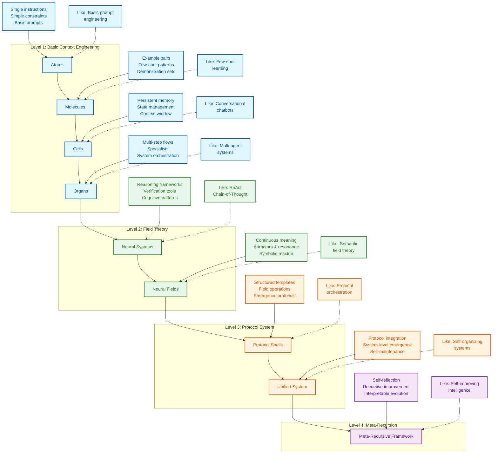

<div align="center">
  
# Context Engineering （上下文工程）

</div>


> **"Context engineering is the delicate art and science of filling the context window with just the right information for the next step." — [**Andrej Karpathy**](https://x.com/karpathy/status/1937902205765607626)**
>
> [**Software Is Changing (Again) Talk @YC AI Startup School**](https://www.youtube.com/watch?v=LCEmiRjPEtQ)

> **“上下文工程是一门精巧的艺术和科学，旨在为下一步填充恰到好处的信息到上下文窗口中。” — [**Andrej Karpathy**](https://x.com/karpathy/status/1937902205765607626)**
>
> [**软件正在（再次）改变 YC AI 创业学校演讲**](https://www.youtube.com/watch?v=LCEmiRjPEtQ)


<div align="center">
  
## [Chat with NotebookLM + Podcast Deep Dive](https://notebooklm.google.com/notebook/0c6e4dc6-9c30-4f53-8e1a-05cc9ff3bc7e) （与 NotebookLM 聊天 + 播客深度探讨）

## [](https://discord.gg/pCM6kdxB)
## [](https://deepwiki.com/davidkimai/Context-Engineering)

</div>

## [Comprehensive Course Under Construction](https://github.com/davidkimai/Context-Engineering/tree/main/00_COURSE) （综合课程建设中）

> ### **[From A Systematic Analysis of Over 1400 Research Papers — A Survey of Context Engineering for Large Language Models](https://arxiv.org/pdf/2507.13334)**
>
> [**Awesome Context Engineering Repo**](https://github.com/Meirtz/Awesome-Context-Engineering)

> ### **[来自对 1400 多篇研究论文的系统分析——大型语言模型上下文工程综述](https://arxiv.org/pdf/2507.13334)**
>
> [**Awesome Context Engineering Repo**](https://github.com/Meirtz/Awesome-Context-Engineering)

Operationalizing the Latest Research on Context With First Principles & Visuals — July 2025 from ICML, IBM, NeurIPS, OHBM, and more 
将最新的上下文研究与第一性原理和可视化相结合——2025 年 7 月来自 ICML、IBM、NeurIPS、OHBM 等


> **"Providing “cognitive tools” to GPT-4.1 increases its pass@1 performance on AIME2024 from 26.7% to 43.3%, bringing it very close to the performance of o1-preview."** — [**IBM Zurich**](https://www.arxiv.org/pdf/2506.12115)

> **“向 GPT-4.1 提供“认知工具”可将其在 AIME2024 上的 pass@1 性能从 26.7% 提高到 43.3%，使其非常接近 o1-preview 的性能。”** — [**IBM 苏黎世**](https://www.arxiv.org/pdf/2506.12115)

<div align="center">
  
## [`AgenticOS`](https://github.com/davidkimai/Context-Engineering/tree/main/.claude/commands)
**Support for [Claude Code](https://www.anthropic.com/claude-code) | [OpenCode](https://opencode.ai/) | [Amp](https://sourcegraph.com/amp) | [Kiro](https://kiro.dev/) | [Codex](https://openai.com/codex/) | [Gemini CLI](https://github.com/google-gemini/gemini-cli)**

### **[IBM Zurich](https://www.arxiv.org/pdf/2506.12115) | [Quantum Semantics](https://arxiv.org/pdf/2506.10077) | [Emergent Symbolics ICML Princeton](https://openreview.net/forum?id=y1SnRPDWx4) | [MEM1 Singapore-MIT](https://arxiv.org/pdf/2506.15841) | [LLM Attractors Shanghai AI](https://arxiv.org/pdf/2502.15208?) | [MemOS Shanghai](https://github.com/MemTensor/MemOS) | [Latent Reasoning](https://arxiv.org/pdf/2507.06203) | [Dynamic Recursive Depths](https://arxiv.org/pdf/2507.10524) | [A Systematic Analysis of Over 1400 Research Papers on Context Engineering](https://arxiv.org/pdf/2507.13334)**


</div>

A frontier, first-principles handbook for moving beyond prompt engineering to the wider discipline of context design, orchestration, and optimization.
一本前沿的、第一性原理的手册，用于从提示工程转向更广泛的上下文设计、编排和优化领域。


```
                    Prompt Engineering  │  Context Engineering
                    （提示工程）        │  （上下文工程）
                       ↓                │            ↓                      
               "What you say"           │  "Everything else the model sees"
               （“你说什么”）         │  （“模型看到的其他一切”）
             (Single instruction)       │    (Examples, memory, retrieval,
             （单个指令）           │     tools, state, control flow)
                                        │    （示例、记忆、检索、工具、状态、控制流）
```

## Definition of Context Engineering （上下文工程的定义）

> **Context is not just the single prompt users send to an LLM. Context is the complete information payload provided to a LLM at inference time, encompassing all structured informational components that the model needs to plausibly accomplish a given task.**
>
> — [**Definition of Context Engineering from A Systematic Analysis of Over 1400 Research Papers**](https://arxiv.org/pdf/2507.13334)

> **上下文不仅仅是用户发送给大型语言模型的单个提示。上下文是在推理时提供给大型语言模型的完整信息有效载荷，包含模型为合理完成给定任务所需的所有结构化信息组件。**
>
> — [**来自对 1400 多篇研究论文的系统分析的上下文工程定义**](https://arxiv.org/pdf/2507.13334)

```
╭─────────────────────────────────────────────────────────────╮
│              CONTEXT ENGINEERING MASTERY COURSE             │
│              （上下文工程精通课程）                         │
│                    From Zero to Frontier                    │
│                    （从零到前沿）                             │
╰─────────────────────────────────────────────────────────────╯
                          ▲
                          │
                 Mathematical Foundations
                 （数学基础）
                  C = A(c₁, c₂, ..., cₙ)
                          │
                          ▼
┌─────────────┬──────────────┬──────────────┬─────────────────┐
│ FOUNDATIONS │ SYSTEM IMPL  │ INTEGRATION  │ FRONTIER        │
│ （基础）    │ （系统实现） │ （集成）     │ （前沿）        │
│ (Weeks 1-4) │ (Weeks 5-8)  │ (Weeks 9-10) │ (Weeks 11-12)   │
└─────┬───────┴──────┬───────┴──────┬───────┴─────────┬───────┘
      │              │              │                 │
      ▼              ▼              ▼                 ▼
┌─────────────┐ ┌──────────────┐ ┌──────────────┐ ┌──────────────┐
│ Math Models │ │ RAG Systems  │ │ Multi-Agent  │ │ Meta-Recurs  │
│ （数学模型）│ │ （RAG 系统） │ │ （多智能体） │ │ （元递归）   │
│ Components  │ │ Memory Arch  │ │ Orchestrat   │ │ Quantum Sem  │
│ （组件）    │ │ （记忆架构） │ │ （编排）     │ │ （量子语义） │
│ Processing  │ │ Tool Integr  │ │ Field Theory │ │ Self-Improv  │
│ （处理）    │ │ （工具集成） │ │ （场论）     │ │ （自我改进） │
│ Management  │ │ Agent Systems│ │ Evaluation   │ │ Collaboration│
│ （管理）    │ │ （智能体系统）│ │ （评估）     │ │ （协作）     │
└─────────────┘ └──────────────┘ └──────────────┘ └──────────────┘
```


## Why This Repository Exists （本仓库存在的原因）

> **"Meaning is not an intrinsic, static property of a semantic expression, but rather an emergent phenomenon"
— [Agostino et al. — July 2025, Indiana University](https://arxiv.org/pdf/2506.10077)**

> **“意义并非语义表达的内在、静态属性，而是一种涌现现象”
— [Agostino 等人 — 2025 年 7 月，印第安纳大学](https://arxiv.org/pdf/2506.10077)**

Prompt engineering received all the attention, but we can now get excited for what comes next. Once you've mastered prompts, the real power comes from engineering the **entire context window** that surrounds those prompts. Guiding thought, if you will. 
提示工程备受关注，但现在我们可以为接下来的事情感到兴奋。一旦你掌握了提示，真正的力量就来自于工程化围绕这些提示的**整个上下文窗口**。可以说，是引导思想。

This repository provides a progressive, first-principles approach to context engineering, built around a biological metaphor:
该存储库提供了一种渐进的、第一性原理的上下文工程方法，该方法围绕生物学隐喻构建：

```
atoms → molecules → cells → organs → neural systems → neural & semantic field theory 
  │        │         │         │             │                         │        
single    few-     memory +   multi-   cognitive tools +     context = fields +
prompt    shot     agents     agents   operating systems     persistence & resonance
（单个提示）→（少样本）→（记忆+代理）→（多代理）→（认知工具+操作系统）→（上下文=场+持久性与共振）
```
> "Abstraction is the cost of generalization"— [**Grant Sanderson (3Blue1Brown)**](https://www.3blue1brown.com/)
> “抽象是泛化的代价”——[**Grant Sanderson (3Blue1Brown)**](https://www.3blue1brown.com/)


<div align="center">


*[A Survey of Context Engineering - July 2025](https://arxiv.org/pdf/2507.13334)*
*[上下文工程综述 - 2025 年 7 月](https://arxiv.org/pdf/2507.13334)*


  
 **[On Emergence, Attractors, and Dynamical Systems Theory](https://content.csbs.utah.edu/~butner/systems/DynamicalSystemsIntro.html) | [Columbia DST](http://wordpress.ei.columbia.edu/ac4/about/our-approach/dynamical-systems-theory/)**

 **[关于涌现、吸引子和动力系统理论](https://content.csbs.utah.edu/~butner/systems/DynamicalSystemsIntro.html) | [哥伦比亚大学 DST](http://wordpress.ei.columbia.edu/ac4/about/our-approach/dynamical-systems-theory/)**


https://github.com/user-attachments/assets/9f046259-e5ec-4160-8ed0-41a608d8adf3


</div>




## Under Construction （建设中）

```python
Context-Engineering/
├── LICENSE                          # MIT license （MIT 许可证）
├── README.md                        # Quick-start overview （快速入门概述）
├── structure.md                     # Original structural map （原始结构图）
├── STRUCTURE_v2.md                  # Enhanced structural map with field theory （带有场论的增强结构图）
├── context.json                     # Original schema configuration （原始模式配置）
├── context_v2.json                  # Extended schema with field protocols （带有场协议的扩展模式）
├── context_v3.json                  # Neural field extensions （神经场扩展）
├── context_v3.5.json                # Symbolic mechanism integration （符号机制集成）
├── CITATIONS.md                     # Research references and bridges （研究参考文献和桥梁）
│
├── 00_foundations/                  # First-principles theory （第一性原理理论）
│   ├── 01_atoms_prompting.md        # Atomic instruction units （原子指令单元）
│   ├── 02_molecules_context.md      # Few-shot examples/context （少样本示例/上下文）
│   ├── 03_cells_memory.md           # Stateful conversation layers （有状态对话层）
│   ├── 04_organs_applications.md    # Multi-step control flows （多步控制流）
│   ├── 05_cognitive_tools.md        # Mental model extensions （心智模型扩展）
│   ├── 06_advanced_applications.md  # Real-world implementations （实际应用）
│   ├── 07_prompt_programming.md     # Code-like reasoning patterns （类代码推理模式）
│   ├── 08_neural_fields_foundations.md # Context as continuous fields （作为连续场的上下文）
│   ├── 09_persistence_and_resonance.md # Field dynamics and attractors （场动力学和吸引子）
│   ├── 10_field_orchestration.md    # Coordinating multiple fields （协调多个场）
│   ├── 11_emergence_and_attractor_dynamics.md # Emergent properties （涌现属性）
│   │── 12_symbolic_mechanisms.md    # Symbolic reasoning in LLMs （大型语言模型中的符号推理）
│   ├── 13_quantum_semantics.md      # Multiple meanings (Superposition) （多重意义（叠加））
│   └── 14_unified_field_theory.md   # Integrating theory models （整合理论模型）
│
├── 10_guides_zero_to_hero/          # Hands-on tutorials （动手教程）
│   ├── 01_min_prompt.ipynb          # Minimal prompt experiments （最小提示实验）
│   ├── 02_expand_context.ipynb      # Context expansion techniques （上下文扩展技术）
│   ├── 03_control_loops.ipynb       # Flow control mechanisms （流控制机制）
│   ├── 04_rag_recipes.ipynb         # Retrieval-augmented patterns （检索增强模式）
│   ├── 05_protocol_bootstrap.ipynb  # Field protocol bootstrap （场协议引导）
│   ├── 06_protocol_token_budget.ipynb # Protocol efficiency （协议效率）
│   ├── 07_streaming_context.ipynb   # Real-time context （实时上下文）
│   ├── 08_emergence_detection.ipynb # Detecting emergence （检测涌现）
│   ├── 09_residue_tracking.ipynb    # Tracking symbolic residue （追踪符号残留）
│   └── 10_attractor_formation.ipynb # Creating field attractors （创建场吸引子）
│
├── 20_templates/                    # Reusable components （可复用组件）
│   ├── minimal_context.yaml         # Base context structure （基础上下文结构）
│   ├── control_loop.py              # Orchestration template （编排模板）
│   ├── scoring_functions.py         # Evaluation metrics （评估指标）
│   ├── prompt_program_template.py   # Program structure template （程序结构模板）
│   ├── schema_template.yaml         # Schema definition template （模式定义模板）
│   ├── recursive_framework.py       # Recursive context template （递归上下文模板）
│   ├── field_protocol_shells.py     # Field protocol templates （场协议外壳）
│   ├── symbolic_residue_tracker.py  # Residue tracking tools （残留追踪工具）
│   ├── context_audit.py             # Context analysis tool （上下文分析工具）
│   ├── shell_runner.py              # Protocol shell runner （协议外壳运行器）
│   ├── resonance_measurement.py     # Field resonance metrics （场共振指标）
│   ├── attractor_detection.py       # Attractor analysis tools （吸引子分析工具）
│   ├── boundary_dynamics.py         # Boundary operation tools （边界操作工具）
│   └── emergence_metrics.py         # Emergence measurement （涌现测量）
│
├── 30_examples/                     # Practical implementations （实际应用）
│   ├── 00_toy_chatbot/              # Simple conversation agent （简单对话代理）
│   ├── 01_data_annotator/           # Data labeling system （数据标注系统）
│   ├── 02_multi_agent_orchestrator/ # Agent collaboration system （代理协作系统）
│   ├── 03_vscode_helper/            # IDE integration （IDE 集成）
│   ├── 04_rag_minimal/              # Minimal RAG implementation （最小 RAG 实现）
│   ├── 05_streaming_window/         # Real-time context demo （实时上下文演示）
│   ├── 06_residue_scanner/          # Symbolic residue demo （符号残留演示）
│   ├── 07_attractor_visualizer/     # Field visualization （场可视化）
│   ├── 08_field_protocol_demo/      # Protocol demonstration （协议演示）
│   └── 09_emergence_lab/            # Emergence experimentation （涌现实验）
│
├── 40_reference/                    # Deep-dive documentation （深度文档）
│   ├── token_budgeting.md           # Token optimization strategies （令牌优化策略）
│   ├── retrieval_indexing.md        # Retrieval system design （检索系统设计）
│   ├── eval_checklist.md            # PR evaluation criteria （PR 评估标准）
│   ├── cognitive_patterns.md        # Reasoning pattern catalog （推理模式目录）
│   ├── schema_cookbook.md           # Schema pattern collection （模式模式集合）
│   ├── patterns.md                  # Context pattern library （上下文模式库）
│   ├── field_mapping.md             # Field theory fundamentals （场论基础）
│   ├── symbolic_residue_types.md    # Residue classification （残留分类）
│   ├── attractor_dynamics.md        # Attractor theory and practice （吸引子理论与实践）
│   ├── emergence_signatures.md      # Detecting emergence （检测涌现）
│   └── boundary_operations.md       # Boundary management guide （边界管理指南）
│
├── 50_contrib/                      # Community contributions （社区贡献）
│   └── README.md                    # Contribution guidelines （贡献指南）
│
├── 60_protocols/                    # Protocol shells and frameworks （协议外壳和框架）
│   ├── README.md                    # Protocol overview （协议概述）
│   ├── shells/                      # Protocol shell definitions （协议外壳定义）
│   │   ├── attractor.co.emerge.shell      # Attractor co-emergence （吸引子共现）
│   │   ├── recursive.emergence.shell      # Recursive field emergence （递归场涌现）
│   │   ├── recursive.memory.attractor.shell # Memory persistence （记忆持久性）
│   │   └── field.resonance.scaffold.shell  # Field resonance （场共振）
│   ├── digests/                     # Simplified protocol documentation （简化协议文档）
│   └── schemas/                     # Protocol schemas （协议模式）
│       ├── fractalRepoContext.v3.5.json    # Repository context （存储库上下文）
│       ├── fractalConsciousnessField.v1.json # Field schema （场模式）
│       ├── protocolShell.v1.json           # Shell schema （外壳模式）
│       ├── symbolicResidue.v1.json         # Residue schema （残留模式）
│       └── attractorDynamics.v1.json       # Attractor schema （吸引子模式）
│
├── 70_agents/                       # Agent demonstrations （代理演示）
│   ├── README.md                    # Agent overview （代理概述）
│   ├── 01_residue_scanner/          # Symbolic residue detection （符号残留检测）
│   └── 02_self_repair_loop/         # Self-repair protocol （自我修复协议）
│
├── 80_field_integration/            # Complete field projects （完整的场项目）
│   ├── README.md                    # Integration overview （集成概述）
│   ├── 00_protocol_ide_helper/      # Protocol development tools （协议开发工具）
│   └── 01_context_engineering_assistant/ # Field-based assistant （基于场的助手）
│
├── cognitive-tools/                 # Advanced cognitive framework （高级认知框架）
│   ├── README.md                    # Overview and quick-start guide （概述和快速入门指南）
│   ├── cognitive-templates/         # Templates for reasoning （推理模板）
│   │   ├── understanding.md         # Comprehension operations （理解操作）
│   │   ├── reasoning.md             # Analytical operations （分析操作）
│   │   ├── verification.md          # Checking and validation （检查和验证）
│   │   └── composition.md           # Combining multiple tools （组合多个工具）
│   │
│   ├── cognitive-programs/          # Structured prompt programs （结构化提示程序）
│   │   ├── basic-programs.md        # Fundamental program structures （基本程序结构）
│   │   ├── advanced-programs.md     # Complex program architectures （复杂程序架构）
│   │   ├── program-library.py       # Python implementations （Python 实现）
│   │   └── program-examples.ipynb   # Interactive examples （交互式示例）
│   │
│   ├── cognitive-schemas/           # Knowledge representations （知识表示）
│   │   ├── user-schemas.md          # User information schemas （用户信息模式）
│   │   ├── domain-schemas.md        # Domain knowledge schemas （领域知识模式）
│   │   ├── task-schemas.md          # Reasoning task schemas （推理任务模式）
│   │   └── schema-library.yaml      # Reusable schema library （可复用模式库）
│   │
│   ├── cognitive-architectures/     # Complete reasoning systems （完整的推理系统）
│   │   ├── solver-architecture.md   # Problem-solving systems （问题解决系统）
│   │   ├── tutor-architecture.md    # Educational systems （教育系统）
│   │   ├── research-architecture.md # Information synthesis （信息综合）
│   │   └── architecture-examples.py # Implementation examples （实现示例）
│   │
│   └── integration/                 # Integration patterns （集成模式）
│       ├── with-rag.md              # Integration with retrieval （与检索集成）
│       ├── with-memory.md           # Integration with memory （与记忆集成）
│       ├── with-agents.md           # Integration with agents （与代理集成）
│       └── evaluation-metrics.md    # Effectiveness measurement （有效性测量）
│
└── .github/                         # GitHub configuration （GitHub 配置）
    ├── CONTRIBUTING.md              # Contribution guidelines （贡献指南）
    ├── workflows/ci.yml             # CI pipeline configuration （CI 管道配置）
    ├── workflows/eval.yml           # Evaluation automation （评估自动化）
    └── workflows/protocol_tests.yml # Protocol testing （协议测试）
```

## Quick Start （快速入门）

1. **Read `00_foundations/01_atoms_prompting.md`** (5 min)  
   Understand why prompts alone often underperform
   了解为什么仅有提示通常表现不佳

2. **Run `10_guides_zero_to_one/01_min_prompt.py (Jupyter Notebook style)`**  
   Experiment with a minimal working example
   使用最小的可工作示例进行实验

3. **Explore `20_templates/minimal_context.yaml`**  
   Copy/paste a template into your own project  
   将模板复制/粘贴到您自己的项目中

4. **Study `30_examples/00_toy_chatbot/`**  
   See a complete implementation with context management
   查看带有上下文管理的完整实现

## Learning Path （学习路径）

```
┌─────────────────┐     ┌──────────────────┐     ┌────────────────┐
│ 00_foundations/ │     │ 10_guides_zero_  │     │ 20_templates/  │
│ （基础）        │────▶│ to_one/          │────▶│                │
│ Theory & core   │     │ Hands-on         │     │ Copy-paste     │
│ concepts        │     │ walkthroughs     │     │ snippets       │
│ （理论与核心概念）│     │ （动手实践）     │     │ （复制粘贴代码片段）│
└─────────────────┘     └──────────────────┘     └────────────────┘
         │                                                │
         │                                                │
         ▼                                                ▼
┌─────────────────┐                             ┌────────────────┐
│ 40_reference/   │◀───────────────────────────▶│ 30_examples/   │
│ （参考）        │                             │ （示例）       │
│ Deep dives &    │                             │ Real projects, │
│ eval cookbook   │                             │ progressively  │
│ （深入探讨与评估手册）│                             │ complex        │
└─────────────────┘                             │ （真实项目，逐步复杂）│
         ▲                                      └────────────────┘
         │                                                ▲
         │                                                │
         └────────────────────┐               ┌───────────┘
                              ▼               ▼
                         ┌─────────────────────┐
                         │ 50_contrib/         │
                         │ （贡献）            │
                         │ Community           │
                         │ contributions       │
                         │ （社区贡献）        │
                         └─────────────────────┘
```

## What You'll Learn （你将学到什么）

| Concept | What It Is | Why It Matters |
|---------|------------|----------------|
| **Token Budget** | Optimizing every token in your context | More tokens = more $$ and slower responses |
| **Few-Shot Learning** | Teaching by showing examples | Often works better than explanation alone |
| **Memory Systems** | Persisting information across turns | Enables stateful, coherent interactions |
| **Retrieval Augmentation** | Finding & injecting relevant documents | Grounds responses in facts, reduces hallucination |
| **Control Flow** | Breaking complex tasks into steps | Solve harder problems with simpler prompts |
| **Context Pruning** | Removing irrelevant information | Keep only what's necessary for performance |
| **Metrics & Evaluation** | Measuring context effectiveness | Iterative optimization of token use vs. quality |
| **Cognitive Tools & Prompt Programming** | Learm to build custom tools and templates | Prompt programming enables new layers for context engineering |
| **Neural Field Theory** | Context as a Neural Field | Modeling context as a dynamic neural field allows for iterative context updating |
| **Symbolic Mechanisms** | Symbolic architectures enable higher order reasoning | Smarter systems = less work |
| **Quantum Semantics** |  Meaning as observer-dependent  | Design context systems leveraging superpositional techniques |

| 概念 | 它是什么 | 为什么重要 |
|---------|------------|----------------|
| **令牌预算** | 优化上下文中的每个令牌 | 更多的令牌 = 更多的花费和更慢的响应 |
| **少样本学习** | 通过展示示例进行教学 | 通常比单独解释效果更好 |
| **记忆系统** | 在多轮对话中持久化信息 | 实现有状态、连贯的交互 |
| **检索增强** | 查找并注入相关文档 | 将响应建立在事实上，减少幻觉 |
| **控制流** | 将复杂任务分解为多个步骤 | 用更简单的提示解决更难的问题 |
| **上下文修剪** | 移除不相关的信息 | 只保留性能所必需的内容 |
| **指标与评估** | 衡量上下文的有效性 | 令牌使用与质量的迭代优化 |
| **认知工具与提示编程** | 学习构建自定义工具和模板 | 提示编程为上下文工程开启了新的层次 |
| **神经场论** | 上下文作为神经场 | 将上下文建模为动态神经场可以实现迭代的上下文更新 |
| **符号机制** | 符号架构支持高阶推理 | 更智能的系统 = 更少的工作 |
| **量子语义学** |  意义依赖于观察者  | 设计利用叠加技术的上下文系统 |


## Karpathy + 3Blue1Brown Inspired Style （Karpathy + 3Blue1Brown 启发风格）

> For learners of all experience levels
> 适合所有经验水平的学习者

1. **First principles** – start with the fundamental context
   **第一性原理** – 从基本上下文开始
2. **Iterative add-on** – add only what the model demonstrably lacks
   **迭代添加** – 只添加模型明显缺乏的内容
3. **Measure everything** – token cost, latency, quality score
   **测量一切** – 令牌成本、延迟、质量得分
4. **Delete ruthlessly** – pruning beats padding
   **无情删除** – 修剪胜于填充
5. **Code > slides** – every concept has a runnable cell
   **代码 > 幻灯片** – 每个概念都有一个可运行的单元格
6. **Visualize everything** — every concept is visualized with ASCII and symbolic diagrams
   **可视化一切** — 每个概念都用 ASCII 和符号图进行可视化

# Research Evidence （研究证据）
## Memory + Reasoning （记忆 + 推理）

### **[MEM1: Learning to Synergize Memory and Reasoning for Efficient Long-Horizon Agents - Singapore-MIT June 2025](https://www.arxiv.org/pdf/2506.15841)**

> “Our results demonstrate the promise of reasoning-driven memory consolidation as a scalable alternative to existing solutions for training long-horizon interactive agents, where both efficiency and performance are optimized." — [Singapore-MIT](https://arxiv.org/pdf/2506.15841)

> “我们的结果表明，推理驱动的记忆巩固作为训练长时程交互式代理的现有解决方案的可扩展替代方案，具有广阔的前景，其中效率和性能都得到了优化。” — [新加坡-麻省理工学院](https://arxiv.org/pdf/2506.15841)


1. **MEM1 trains AI agents to keep only what matters—merging memory and reasoning at every step—so they never get overwhelmed, no matter how long the task.**
   **MEM1 训练 AI 代理只保留重要的东西——在每一步都融合记忆和推理——这样无论任务多长，它们都不会不知所措。**

2. **Instead of piling up endless context, MEM1 compresses each interaction into a compact “internal state,” just like a smart note that gets updated, not recopied.**
   **MEM1 不会堆积无休止的上下文，而是将每次交互压缩成一个紧凑的“内部状态”，就像一个会更新而不是重新复制的智能笔记。**

3. **By blending memory and thinking into a single flow, MEM1 learns to remember only the essentials—making agents faster, sharper, and able to handle much longer conversations.**
   **通过将记忆和思维融合成一个单一的流程，MEM1 学会了只记住要点——使代理更快、更敏锐，并能够处理更长的对话。**

4. **Everything the agent does is tagged and structured, so each action, question, or fact is clear and easy to audit—no more mystery meat memory.**
   **代理所做的一切都经过标记和结构化，因此每个操作、问题或事实都清晰易于审计——不再有神秘的记忆。**

5. **With every cycle, old clutter is pruned and only the latest, most relevant insights are carried forward, mirroring how expert problem-solvers distill their notes.**
   **在每个周期中，旧的杂乱信息都会被修剪，只有最新、最相关的见解才会被保留下来，这反映了专家问题解决者如何提炼他们的笔记。**

6. **MEM1 proves that recursive, protocol-driven memory—where you always refine and integrate—outperforms traditional “just add more context” approaches in both speed and accuracy.**
   **MEM1 证明，递归的、协议驱动的记忆——你总是在其中进行完善和整合——在速度和准确性方面都优于传统的“只添加更多上下文”的方法。**
## Cognitive Tools （认知工具）

### **[Eliciting Reasoning in Language Models with Cognitive Tools - IBM Zurich June 2025](https://www.arxiv.org/pdf/2506.12115)**

### Prompts and Prompt Programs as Reasoning Tool Calls
> “Cognitive tools” encapsulate reasoning operations within the LLM itself — [IBM Zurich](https://www.arxiv.org/pdf/2506.12115)

### 提示和提示程序作为推理工具调用
> “认知工具”在大型语言模型本身内部封装了推理操作 — [IBM 苏黎世](https://www.arxiv.org/pdf/2506.12115)


> **These cognitive tools (structured prompt templates as tool calls) break down the problem by identifying the main concepts at hand, extracting relevant information in the question, and highlighting meaningful properties, theorems, and techniques that
might be helpful in solving the problem.**

> **这些认知工具（作为工具调用的结构化提示模板）通过识别手头的核心概念、提取问题中的相关信息，并突出显示可能有助于解决问题的有意义的属性、定理和技术来分解问题。**


> **These templates scaffold reasoning layers similar to cognitive mental shortcuts, commonly studied as "heuristics".**

> **这些模板构建了类似于认知心理捷径的推理层，通常作为“启发式”进行研究。**

1. **This research shows that breaking complex tasks into modular “cognitive tools” lets AI solve problems more thoughtfully—mirroring how expert humans reason step by step.**
   **这项研究表明，将复杂任务分解为模块化的“认知工具”可以让 AI 更深思熟虑地解决问题——模仿专家人类如何逐步推理。**

2. **Instead of relying on a single, big prompt, the model calls specialized prompt templates, aka cognitive tools like “understand question,” “recall related,” “examine answer,” and “backtracking”—each handling a distinct mental operation.**
   **模型不依赖于单个的大提示，而是调用专门的提示模板，即认知工具，如“理解问题”、“回忆相关”、“检查答案”和“回溯”——每个工具处理一个独特的心理操作。**

3. **Cognitive tools work like inner mental shortcuts: the AI picks the right program at each stage and runs it to plan its reasoning and downstream actions before conducting the task for greater accuracy and flexibility.**
   **认知工具就像内在的心理捷径：AI 在每个阶段选择正确的程序并运行它来规划其推理和下游行动，然后在执行任务之前获得更高的准确性和灵活性。**

4. **By compartmentalizing reasoning steps into modular blocks, these tools prevent confusion, reduce error, and make the model’s thought process transparent and auditable—even on hard math problems.**
   **通过将推理步骤划分到模块化的块中，这些工具可以防止混淆、减少错误，并使模型的思维过程透明且可审计——即使在困难的数学问题上也是如此。**

5. **This modular approach upgrades both open and closed models—boosting real-world math problem-solving and approaching the performance of advanced RL-trained “reasoning” models, without extra training.**
   **这种模块化方法升级了开放和封闭模型——提高了现实世界中数学问题的解决能力，并接近了经过高级强化学习训练的“推理”模型的性能，而无需额外训练。**

6. **The results suggest that the seeds of powerful reasoning are already inside large language models—cognitive tools simply unlock and orchestrate these abilities, offering a transparent, efficient, and interpretable alternative to black-box tuning.**
   **结果表明，强大推理的种子已经存在于大型语言模型中——认知工具只是解锁和协调这些能力，为黑箱调整提供了一种透明、高效和可解释的替代方案。**
## Emergent Symbols （涌现符号）

## **[Emergent Symbolic Mechanisms Support Abstract Reasoning in Large Language Models - ICML Princeton June 18, 2025](https://openreview.net/forum?id=y1SnRPDWx4)**


> **TL;DR: A three-stage architecture is identified that supports abstract reasoning in LLMs via a set of emergent symbol-processing mechanisms.**
>
>


**These include symbolic induction heads, symbolic abstraction heads, and retrieval heads.**

**1. In early layers, symbol abstraction heads convert input tokens to abstract variables based on the relations between those tokens.**

**2. In intermediate layers, symbolic induction heads perform sequence induction over these abstract variables.**

**3. Finally, in later layers, retrieval heads predict the next token by retrieving the value associated with the predicted abstract variable.**

**These results point toward a resolution of the longstanding debate between symbolic and neural network approaches, suggesting that emergent reasoning in neural networks depends on the emergence of symbolic mechanisms.** — [**ICML Princeton**](https://openreview.net/forum?id=y1SnRPDWx4) 


>
> **Why Useful?**
>
>
> **This supports why Markdown, Json, and similar structured, symbolic formats are more easily LLM parsable**
>
> **Concept: Collaborate with agents to apply delimiters, syntax, symbols, symbolic words, metaphors and structure to improve reasoning/context/memory/persistence during inference**

1. **This paper proves that large language models develop their own inner symbolic “logic circuits”—enabling them to reason with abstract variables, not just surface word patterns.**
   **这篇论文证明，大型语言模型会发展出自己的内部符号“逻辑电路”——使它们能够用抽象变量进行推理，而不仅仅是表面的词语模式。**

2. **LLMs show a three-stage process: first abstracting symbols from input, then reasoning over these variables, and finally mapping the abstract answer back to real-world tokens.**
   **大型语言模型表现出一个三阶段过程：首先从输入中抽象出符号，然后对这些变量进行推理，最后将抽象答案映射回现实世界的令牌。**

3. **These emergent mechanisms mean LLMs don’t just memorize—they actually create internal, flexible representations that let them generalize to new problems and analogies.**
   **这些涌现机制意味着大型语言模型不仅仅是记忆——它们实际上创建了内部的、灵活的表示，使它们能够泛化到新的问题和类比。**

4. **Attention heads in early layers act like “symbol extractors,” intermediate heads perform symbolic reasoning, and late heads retrieve the concrete answer—mirroring human-like abstraction and retrieval.**
   **早期层中的注意力头就像“符号提取器”，中间层执行符号推理，后期层检索具体答案——模仿人类的抽象和检索。**

5. **By running targeted experiments and interventions, the authors show these symbolic processes are both necessary and sufficient for abstract reasoning, across multiple models and tasks.**
   **通过进行有针对性的实验和干预，作者表明这些符号过程对于跨多个模型和任务的抽象推理既是必要的也是充分的。**

6. **The results bridge the historic gap between symbolic AI and neural nets—showing that, at scale, neural networks can invent and use symbolic machinery, supporting real generalization and reasoning.**
   **结果弥合了符号人工智能和神经网络之间的历史鸿沟——表明，在规模上，神经网络可以发明和使用符号机制，支持真正的泛化和推理。**


## Star History （星标历史）

[](https://www.star-history.com/#davidkimai/Context-Engineering&Date)

## Contributing （贡献）

We welcome contributions! Check out [CONTRIBUTING.md](.github/CONTRIBUTING.md) for guidelines.
我们欢迎贡献！有关指南，请查看 [CONTRIBUTING.md](.github/CONTRIBUTING.md)。

## License （许可证）

[MIT License](LICENSE)

## Citation （引用）

```bibtex
@misc{context-engineering,
  author = {Context Engineering Contributors},
  title = {Context Engineering: Beyond Prompt Engineering},
  year = {2025},
  publisher = {GitHub},
  url = {https://github.com/davidkimai/context-engineering}
}
```

## Acknowledgements （致谢）
> I've been looking forward to this being conceptualized and formalized as there wasn't a prior established field. Prompt engineering receives quite the stigma and doesn't quite cover what most researchers and I do.

> 我一直期待着这个概念能够被概念化和形式化，因为之前没有一个既定的领域。提示工程受到了相当大的污名，而且并不能完全涵盖大多数研究人员和我所做的工作。

- [Andrej Karpathy](https://x.com/karpathy/status/1937902205765607626) for coining "context engineering" and inspiring this repo 
- All contributors and the open source community
- [Andrej Karpathy](https://x.com/karpathy/status/1937902205765607626) 创造了“上下文工程”一词并启发了这个仓库
- 所有贡献者和开源社区